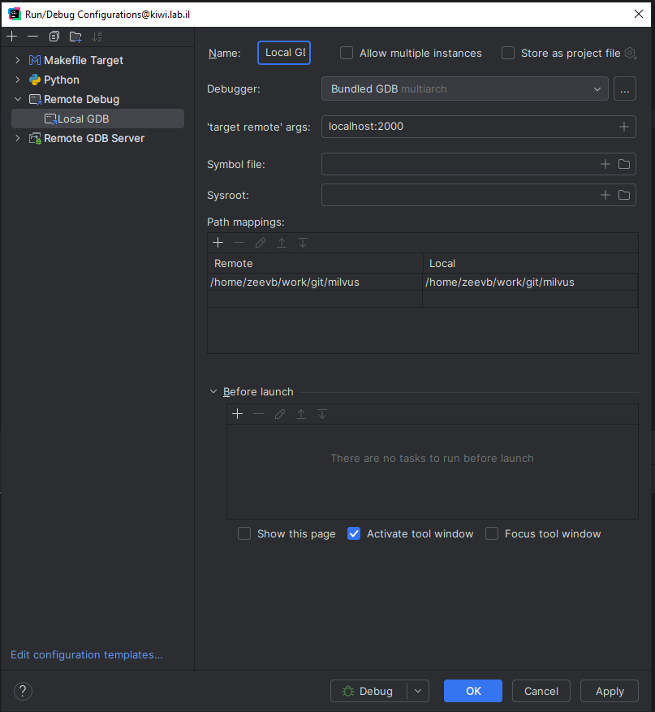

# GDB cheatsheet

* Run application with params
```sh
gdb --args myapp arg1 arg2
```

* Setting env vars
```sh
MY_VAR=MY_VAL gdb --args myapp arg1 arg2
```

* Setting breakpoint: ```b```

* Debugging
```sh
$ gdb ...
(gdb) set directories /src/dir/
(gdb) b launch_sequence
(gdb) layout next
(gdb) run
(gdb) frame
```

* Remote debugging with CLion
```
gdbserver localhost:2000 myapp arg1 arg2
```
